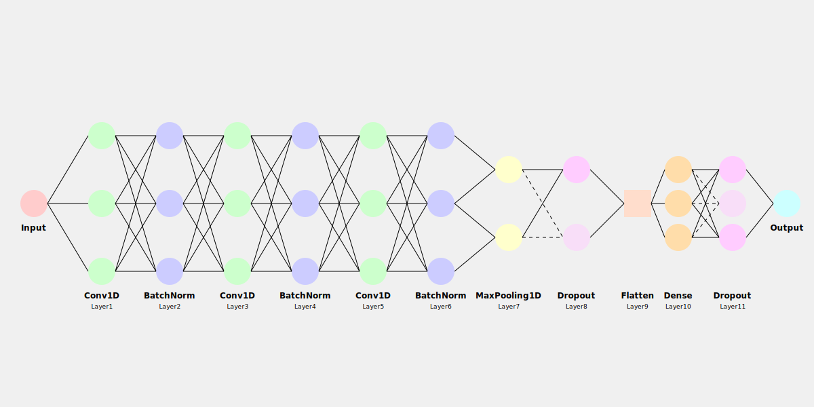

# DeepLearning_Conceptual

> Fuckin compiler error wont shut up in `./src/cnn_model.py` and `./src/lstm_model.py`
>
> That is why there is fuckin `# type: ignore` in every tensorflow.keras import

Somehow, things have been miraculously working.

I'm not sure why...

Below here is Conceptual Structure of each DeepLearning model (I know LightGBM is not a DeepLearning model but CNN and LSTM are kinda DeepLearning models, let's be cool with this)

```
These codes are actually functional, but I've edited some parts as they're intended for conceptual understanding.

You can make these codes fully operational by fixing them yourself and obtaining your own datasets.
```

---

## CNN


## LSTM


*images are also conceptual so actually there is some error.*